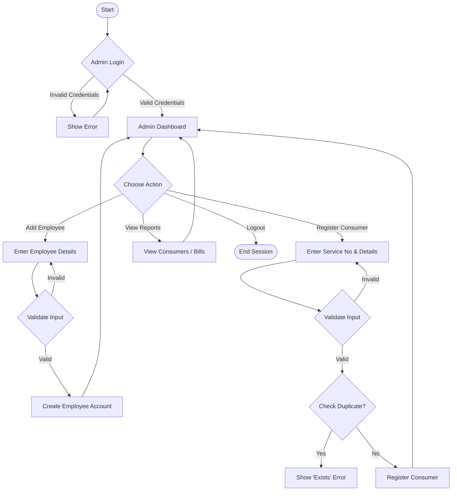

# ELECTRICITY BILL MANAGEMENT SYSTEM - MODULE DOCUMENTATION

**Project:** Electricity Bill Management System - TGSPDCL  
**Version:** 2.0.0  
**Date:** January 27, 2026  
**Author:** ANTU DAS

---

## TABLE OF CONTENTS

1. [System Flowcharts](#system-flowcharts)
   - [Admin Workflow](#admin-workflow)
2. [Module Specifications](#module-specifications)
   - [Admin Module](#1-admin-module)
   - [Validation Module](#2-validation-module)
   - [Computation Module](#3-computation-module)
   - [Database Module](#4-database-module)
   - [Configuration Module](#5-configuration-module)

---

## SYSTEM FLOWCHARTS

### ADMIN WORKFLOW



---

## MODULE SPECIFICATIONS

### 1. ADMIN MODULE

**File:** `admin/add_employee.php`, `admin/register_consumer.php`

#### 1.1 registerConsumer()

| **Module Name**    | registerConsumer |
| **Input**          | service_no, name, type, mobile, address |
| **Pre-conditions** | - Admin logged in<br>- Service No unique |
| **Output**         | Boolean - True on success |

**Algorithm:**
```
1. Receive input data
2. Call validateServiceNumber(), validateName(), validateMobile()
3. IF any validation fails → Return Error
4. Query DB: Check if service_no exists
5. IF exists → Return Error "Duplicate Service No"
6. Insert into 'consumers' table
7. Return Success
```

**Pseudo Code:**
```
FUNCTION registerConsumer(data)
    IF NOT validateServiceNumber(data.service_no) THEN RETURN Error
    IF NOT validateName(data.name) THEN RETURN Error
    
    SET existing = DB.find("consumers", data.service_no)
    IF existing THEN RETURN Error "Duplicate"
    
    DB.insert("consumers", data)
    RETURN True
END FUNCTION
```

---

### 2. VALIDATION MODULE

**File:** `utils/validators.php`

#### 1.1 validateName()

| **Module Name**    | validateName |
| **Input**          | name (string) - Consumer name to validate |
| **Pre-conditions** | - name must be a string<br>- name must not be empty |
| **Output**         | Boolean - true if valid (alphabets only), false otherwise |

**Algorithm:**
```
1. Check if name is valid
2. Define regex pattern: /^[a-zA-Z\s]+$/
3. Validate: name matches pattern
4. Return validation result
```

**Pseudo Code:**
```
FUNCTION validateName(name)
    SET nameRegex = /^[a-zA-Z\s]+$/
    IF nameRegex matches name THEN
        RETURN true
    ELSE
        RETURN false
    END IF
END FUNCTION
```

---

#### 1.2 validateMobile()

| **Module Name**    | validateMobile |
| **Input**          | mobile (string) - Mobile number to validate |
| **Pre-conditions** | mobile must be a string |
| **Output**         | Boolean - true if exactly 10 digits |

**Algorithm:**
```
1. Check if mobile is valid
2. Define regex pattern: /^\d{10}$/
3. Match mobile against pattern
4. Return match result
```

**Pseudo Code:**
```
FUNCTION validateMobile(mobile)
    SET mobileRegex = /^\d{10}$/
    RETURN mobileRegex matches mobile
END FUNCTION
```

---

#### 1.3 validateServiceNumber()

| **Module Name**    | validateServiceNumber |
| **Input**          | service_number (string) - Service number to validate |
| **Pre-conditions** | service_number must be a string |
| **Output**         | Boolean - true if exactly 6 digits |

**Algorithm:**
```
1. Check if service_number is valid
2. Define regex pattern: /^\d{6}$/
3. Validate service_number matches pattern
4. Return validation result
```

**Pseudo Code:**
```
FUNCTION validateServiceNumber(service_number)
    SET serviceRegex = /^\d{6}$/
    RETURN serviceRegex matches service_number
END FUNCTION
```

---

### 3. COMPUTATION MODULE

**File:** `utils/bill_calculator.php`

#### 3.1 calculateBill()

| **Module Name**    | calculateBill |
| **Input**          | type (string), units (number), hasPreviousDue (boolean) |
| **Pre-conditions** | - units ≥ 0<br>- type in ['household','commercial','industry'] |
| **Output**         | Array - Broken down bill components and Total |

**Tiered Pricing (Household Example):**
| Units Range | Rate (Rs/unit) |
|-------------|----------------|
| 1-50        | 1.5            |
| 51-100      | 2.5            |
| 101-150     | 3.5            |
| 151+        | 4.5            |

**Algorithm:**
```
1. Initialize energy_charge = 0
2. IF type == 'household':
   - Calculate slabs (0-50, 51-100, 101-150, >150)
   - Accumulate energy_charge
3. IF units == 0:
   - Set energy_charge = 25 (Minimum Charge)
4. Calculate ed = energy_charge * 0.07
5. Add fixed_charge (12) and customer_charge (75)
6. IF hasPreviousDue == true:
   - Add fine (150)
7. Total = Sum all components
8. Return Array of components
```

**Pseudo Code:**
```
FUNCTION calculateBill(type, units, hasPreviousDue)
    SET energy_charge = 0
    
    IF type == 'household' THEN
        IF units <= 50 THEN energy_charge = units * 1.5
        ELSE IF units <= 100 THEN energy_charge = (50*1.5) + ((units-50)*2.5)
        ELSE IF units <= 150 THEN energy_charge = (50*1.5) + (50*2.5) + ((units-100)*3.5)
        ELSE energy_charge = (50*1.5) + (50*2.5) + (50*3.5) + ((units-150)*4.5)
    END IF
    
    // Minimum Charge Rule
    IF units == 0 THEN
        energy_charge = 25
    END IF
    
    SET ed = energy_charge * 0.07
    SET fine = (hasPreviousDue) ? 150 : 0
    SET total = energy_charge + 12 + 75 + ed + fine
    
    RETURN {total, energy_charge, fixed:12, cust:75, ed, fine}
END FUNCTION
```

---

#### 2.2 calculateDueDate()

| **Module Name**    | calculateDueDate |
| **Input**          | None (uses current date) |
| **Output**         | Date - Due date (14 days from generation) |

**Algorithm:**
```
1. Get current date
2. Add 14 days
3. Return Due Date
```

**Pseudo Code:**
```
FUNCTION calculateDueDate()
    SET dueDate = DATE_ADD(NOW(), INTERVAL 14 DAY)
    RETURN dueDate
END FUNCTION
```

---

### 4. DATABASE MODULE

**File:** `config/db.php`

#### 4.1 createConnection()

| **Module Name**    | mysqli_connect |
| **Input**          | Host, Username, Password, Database |
| **Pre-conditions** | - WAMP Server running<br>- MySQL Database exists |
| **Output**         | Connection Object or Error |

**Algorithm:**
```
1. Define Config: host="localhost", user="root", pass="", db="tgspdcl"
2. Initialize mysqli_connection
3. IF connection fails → Die with Error
4. ELSE → Return Connection
```

**Pseudo Code:**
```
FUNCTION createConnection()
    SET conn = mysqli_connect("localhost", "root", "", "tgspdcl")
    
    IF NOT conn THEN
        DIE("Database connection failed")
    END IF
    
    RETURN conn
END FUNCTION
```

---

### 5. CONFIGURATION MODULE

**File:** `sql/tgspdcl.sql` (Schema Definition)

| **Module Name**    | Schema Config |
| **Input**          | SQL Commands |
| **Output**         | Database Tables |

**Schema Structure:**
```sql
CREATE DATABASE tgspdcl;
USE tgspdcl;

-- 1. USERS TABLE (Admin & Employees)
CREATE TABLE users (
    id INT AUTO_INCREMENT PRIMARY KEY,
    role ENUM('admin','employee') NOT NULL,
    username VARCHAR(50) UNIQUE NOT NULL,
    password VARCHAR(255) NOT NULL,
    name VARCHAR(100),
    mobile VARCHAR(15),
    address TEXT,
    created_at TIMESTAMP DEFAULT CURRENT_TIMESTAMP
);

-- 2. CONSUMERS TABLE
CREATE TABLE consumers (
    id INT AUTO_INCREMENT PRIMARY KEY,
    service_number VARCHAR(6) UNIQUE NOT NULL,
    type ENUM('household','commercial','industry') NOT NULL,
    name VARCHAR(100) NOT NULL,
    mobile VARCHAR(15) NOT NULL,
    address TEXT NOT NULL,
    pincode VARCHAR(6) NOT NULL,
    license_id VARCHAR(50),
    created_at TIMESTAMP DEFAULT CURRENT_TIMESTAMP
);

-- 3. METER READINGS TABLE
CREATE TABLE meter_readings (
    id INT AUTO_INCREMENT PRIMARY KEY,
    service_number VARCHAR(6) NOT NULL,
    prev_unit INT DEFAULT 0,
    curr_unit INT NOT NULL,
    units_used INT NOT NULL,
    month_year VARCHAR(20) NOT NULL,
    reading_date TIMESTAMP DEFAULT CURRENT_TIMESTAMP,
    FOREIGN KEY (service_number) REFERENCES consumers(service_number)
);

-- 4. BILLS TABLE
CREATE TABLE bills (
    id INT AUTO_INCREMENT PRIMARY KEY,
    service_number VARCHAR(6) NOT NULL,
    units INT NOT NULL,

    energy_charge DECIMAL(10,2) DEFAULT 0,
    fixed_charge DECIMAL(10,2) DEFAULT 0,
    customer_charge DECIMAL(10,2) DEFAULT 0,
    ed DECIMAL(10,2) DEFAULT 0,
    surcharge DECIMAL(10,2) DEFAULT 0,
    fine DECIMAL(10,2) DEFAULT 0,

    total DECIMAL(10,2) NOT NULL,
    due_date DATE NOT NULL,
    status ENUM('PAID','UNPAID') DEFAULT 'UNPAID',
    generated_at TIMESTAMP DEFAULT CURRENT_TIMESTAMP,
    FOREIGN KEY (service_number) REFERENCES consumers(service_number)
);
```

**END OF DOCUMENTATION**
